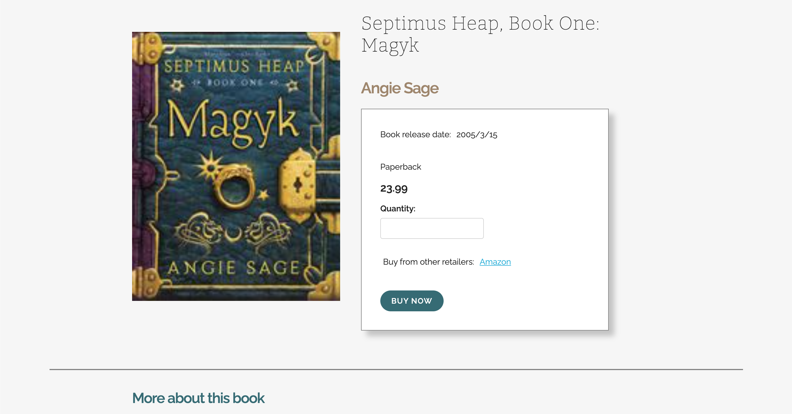

## Book product details page 📚📖🛍🛒

### To build this 'book product details page' I decided to build it in pure vanilla javascript, as this is what I feel the most comfortable with at the moment. I have built websites with WordPress this is what I have built all of my freelancing websites in. I have also had exposure to vue.js in the past as well, although this was some years ago now. In more recent years I have used react.js. But for the complexity of the task I decided vanilla js would be good.

Please follow the steps below to preview my work and let me know if you have any questions at all.

### Enjoy!

#### How to preview the ‘Book products details page’

1. Visit the follow link where I have hosted the website on netlify

https://stoic-lalande-a6c973.netlify.app/

Or 

1. Clone down this repo
2. Unzip the folder
3. Click on the `index.html` file 
4. This should open the file in your default browser where you can preview the book product details page.

If you have any issues with either of these methods please do get in contact and I would be more than happy to assist.

**If I had more time…** I have tried to hit all of the required items, but... Given I had more time to complete this challenge there are a few things I would change / edit / add to further improve this page. There are also a few things in this list which I would do slightly differently now I am slightly reflecting back on working on this task:

- I would have like to have found a way to get multiple reviews showing or at least have built in an option for more reviews if they were available
- Researched future into more book product page designs for an even more intuitive design
- Go with my gut - I picked a new CSS framework I hadn’t used before I definitely needed more time to experiment with it and try it out before trying to use it on something new. I ended up switching over to one I have use multiple times in the past which took me next to no time and left me thinking why didn’t I do this first… 
- Have some kind of mock purchase in place maybe, just to go slightly beyond what the product page looks like
- Redesign the ‘More about this book’ section so that it all ties together a little better
- Do a bit more on the accessibility side
- Changed my ID’s to classes
- Use SCSS

